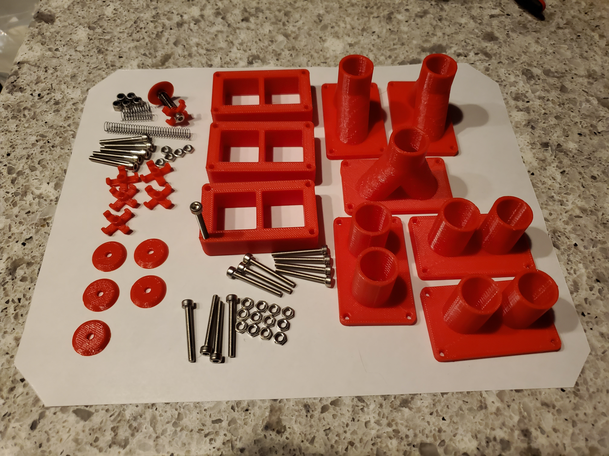

# Ventilator Prototype 1 Bill Of Materials
This is an initial list of the parts required for the 3 valve assemblies. Other components will be added as details are finalized.

## Valve Assembly Parts
Set of parts with one valve assembled:

### Printed Parts

| Quantity | Part Name |
|:--------:|-----------------|
| 3 | Hose Adapter |
| 3 | Valve Box |
| 3 | Hose Manifold |
| 6 | Disk Valve |
| 6 | Valve Bridge |

### Assembly Parts

| Quantity | Part Name | Part specification |
|:--------:|-----------------|----------------|
| 6 | Valve Spring| TBA |
| 6 | Valve Screw | M3x25mm with shank |
| 12 | Valve Box Screw | M3x25mm |
| 6 | Valve Nut | M3 thin nut |
| 6 | Valve Lock Nut | M3 lock nut |
| 12 | Valve Box Nut | M3 thin nut |
